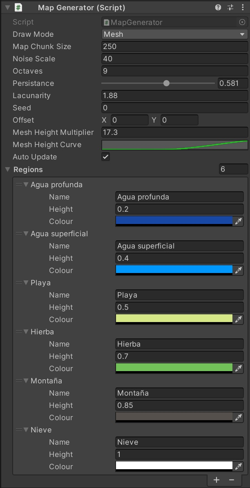

# Taller Unity TryIt! 2024

Este proyecto fue creado por Jonás Rodríguez Unanyan, Maria Laura Hernández Hernández, Cristina Valdés Briales y Valeria Berenice Gil Rubio para el congreso TryIt! 2024

Este proyecto permite visualizar las etapas de creación de un mapa generado procedimentalmente, así como recorrer la versión 3D del mapa creado.

---

## 📚 Índice

- [Instalación](#instalación)
- [Uso](#uso)
- [Estructura](#estructura)

---


## 📦 Instalación

1. Clona el repositorio:
   ```bash
   git clone https://github.com/Jonas-RUnanyan/GAEV.git
   ```
2. Abre Unity Hub.

3. Selecciona "Add" y busca la carpeta del proyecto.

4. Asegúrate de abrirlo con la versión correcta de Unity (2022.3.30f1)

---


## 🧪 Uso

El objeto principal de este proyecto es `MapGenerator`, que es el que controla toda la generación del mapa y en el que se introducen los parámetros. Lo parámetros que podemos controlar son:
- DrawMode, en el que indicamos si queremos ver el ruido del mapa, el mapa en 2D o el mapa en 3D
- El tamaño del mapa.
- Escala de ruido, octavas, persistencia y lacunaridad, parámetros relacionados con el ruido a partir del cual se genera el mapa.
- Semilla y offset.
- Mesh Height Multiplier y Mesh Height Curve, que, sin modificar los datos del mapa, controla lo exageradas que se ven las diferencias en altitud a la hora de mostrar el mapa en 3D.
- Las distintas regiones del mapa, en las que podremos especificar el color de cada una, su nombre y la altura en la que empiezan.
Para comenzar, asegúrate de que el objeto `RoomGenerator` esté **activo** y que el objeto `RoomLoader` esté **inactivo**. Puedes cambiar su estado con clic derecho > *Toggle Active State* en el panel de jerarquía de Unity.



Para poder ver el mapa de cerca y movernos por él, bastará con darle al botón de Play para que empiece la simulación, y podamos movernos por el mapa con una bola. Se recomienda que al hacer esto esté seleccionada la opción Mesh en DrawMode, ya que será la única interesante por tener relieve en 3D
